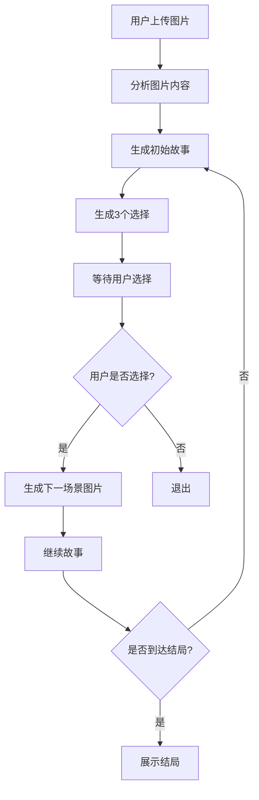

# 交互式图片故事生成系统

## 项目概述

一个基于nano banana + LangGraph的交互式故事生成demo。用户提供一张图片，系统会生成一个互动的故事，每一步用户提供选择来影响故事走向，并通过nano banana生成场景图片。

## 功能特性

1. **图片输入**: 用户上传初始图片
2. **智能分析**: 使用LLM分析图片内容，提取故事元素
3. **故事生成**: 根据图片生成引人入胜的故事开头
4. **选择系统**: 每个场景提供3个不同类型的选择（行动/对话/物品/情感）
5. **动态图片**: 根据选择生成下一场景的图片
6. **剧情发展**: 循环进行直到达成结局
7. **状态管理**: 跟踪故事进度和用户选择历史

## 技术架构

### 核心技术栈
- **Python 3.11**: 主要编程语言
- **LangChain**: LLM集成框架
- **LangGraph**: 故事流程编排引擎
- **nano banana**: 图片生成API (GrsAI)
- **gemini-2.5-flash-lite**: 文本生成模型 (GrsAI)
- **PIL**: 图片处理

### 项目结构

```
game/
├── README.md                    # 项目文档
├── requirements.txt             # Python依赖
├── t.py                        # nano banana测试代码
├── t2.py                       # LLM测试代码
│
├── src/                        # 源代码目录
│   ├── __init__.py
│   │
│   ├── services/              # 服务层
│   │   ├── __init__.py
│   │   ├── nano_banana_client.py    # nano banana API客户端
│   │   ├── llm_client.py            # LLM API客户端
│   │   ├── story_manager.py         # 故事状态管理
│   │   └── image_analyzer.py        # 图片理解分析
│   │
│   ├── graph/                 # LangGraph流程
│   │   ├── __init__.py
│   │   ├── story_flow.py            # 故事流程图
│   │   └── nodes.py                 # 流程节点定义
│   │
│   ├── types/                 # 类型定义
│   │   ├── __init__.py
│   │   └── story.py               # 故事相关类型
│   │
│   └── cli/                   # 命令行界面
│       ├── __init__.py
│       └── main.py                # CLI主程序
│
├── tests/                      # 测试代码
│   ├── test_nano_banana.py
│   ├── test_llm_client.py
│   └── test_story_flow.py
│
└── images/                     # 生成图片存储
    └── .gitkeep
```

## 详细设计

### 1. 故事状态管理 (StoryState)

```python
@dataclass
class StoryState:
    current_image: str                    # 当前场景图片路径
    story_text: str                       # 当前故事文本
    choices: List[Choice]                 # 可选的选择列表
    choice_history: List[str]             # 用户选择历史
    story_progress: float                 # 故事进度 (0-100)
    scene_count: int                      # 当前场景数
    max_scenes: int = 10                  # 最大场景数
    is_ending: bool                       # 是否到达结局
    story_theme: str                      # 故事主题
    genre: StoryGenre                     # 故事类型
    user_attributes: Dict[str, Any]       # 用户属性（如勇气值等）
```

### 2. 核心流程 (LangGraph)



**流程节点:**
1. **analyze_image**: 使用LLM分析上传的图片，提取关键元素
2. **generate_story**: 基于当前状态和图片生成故事内容
3. **create_choices**: 生成3个类型不同的选择选项
4. **generate_scene**: 使用nano banana生成场景图片
5. **check_ending**: 检查是否应该结束故事
6. **update_state**: 更新故事状态

### 3. 选择类型设计

```python
class ChoiceType(Enum):
    ACTION = "action"      # 行动选择 (主动探索/逃避等)
    DIALOGUE = "dialogue"  # 对话选择 (与NPC交流)
    ITEM = "item"         # 物品选择 (使用道具/拾取物品)
    EMOTION = "emotion"   # 情感选择 (冷静/冲动/同情等)
```

每个选择会影响用户属性（如勇气值、智慧值等），从而影响后续故事发展。

### 4. 图片生成提示词工程

**初始场景图片:**
```
基于上传的图片"{image_description}"，创作一个{genre}风格的故事场景。

风格要求:
- 色彩温暖，适合故事氛围
- 构图突出主要元素
- 电影级别的光影效果
- 分辨率: 1024x1024
```

**后续场景图片:**
```
基于当前故事:
"{story_text}"

用户选择: "{choice_text}"

请生成下一场景图片，要求:
1. 与前一个场景风格保持一致
2. 体现选择的后果
3. 场景连贯，过渡自然
4. 突出故事的关键转折点
```

### 5. 故事生成提示词模板

**初始故事:**
```
作为创意故事生成器，基于以下图片描述创作故事：

图片描述: {image_description}

要求:
1. 创作一个{genre}风格的开头 (200-300字)
2. 包含环境描述、角色介绍、情节铺垫
3. 营造悬疑或紧张氛围
4. 引出3个合理的选择

返回JSON格式:
{
  "story": "故事内容",
  "choices": [
    {"id": "1", "text": "选择1", "type": "action"},
    {"id": "2", "text": "选择2", "type": "dialogue"},
    {"id": "3", "text": "选择3", "type": "item"}
  ]
}
```

**故事继续:**
```
当前故事: {story_text}

用户选择: {last_choice} (类型: {choice_type})

请继续故事 (150-200字)，并生成3个新选择，要求:
1. 符合故事逻辑发展
2. 选择应推进情节或揭示信息
3. 多样化选择类型
4. 增加故事的悬念

JSON格式同上
```

### 6. 结局判定逻辑

故事结束的条件:
1. **场景数达到上限**: 超过max_scenes (默认10)
2. **自然结局**: 故事达到高潮并自然结束
3. **用户属性触发**: 某些属性值过高/过低触发特殊结局

不同选择会影响结局类型:
- **勇敢结局**: 正面、胜利的结局
- **智慧结局**: 通过智谋解决问题
- **悲剧结局**: 牺牲或失败（但有意义）
- **隐藏结局**: 需要特定条件才能触发

## 使用流程

### 1. 环境准备

```bash
# 激活conda环境
conda activate game

# 或使用Python直接运行
python src/cli/main.py
```

### 2. 启动应用

```bash
python -m src.cli.main
```

### 3. 交互流程

```
=== 交互式故事生成系统 ===

📸 请上传一张图片: [输入图片路径]

🎬 故事即将开始...
━━━━━━━━━━━━━━━━━━━━━━

[生成的场景图片显示]

📖 故事:
   故事内容...

❓ 选择:
   [1] 选择1
   [2] 选择2
   [3] 选择3

请选择 (1-3): [用户输入]

🎨 正在生成下一场景...
[生成的图片]

... 继续循环 ...

🎭 结局:
   最终结局描述...

✅ 故事结束！共经历了 X 个场景
```

## 未来扩展

### 1. Web界面
- 使用React构建现代化UI
- 支持图片拖拽上传
- 实时展示生成进度
- 美观的图片展示效果

### 2. 多故事类型
- 悬疑推理
- 奇幻冒险
- 科幻探索
- 浪漫爱情
- 恐怖惊悚

### 3. 高级功能
- **故事回溯**: 用户可以回到之前的某个选择点
- **多结局系统**: 根据用户属性值触发不同结局
- **角色成长**: 用户属性随故事发展而变化
- **故事分享**: 生成的故事可导出为PDF或图片
- **AI插画**: 为故事中的关键角色和道具生成独立插图

### 4. 技术优化
- **流式输出**: 故事文本流式显示，提升体验
- **并发生成**: 图片和文本并行生成
- **缓存机制**: 避免重复生成相似内容
- **多语言支持**: 支持生成中文、英文等多种语言的故事

## 开发计划

### Phase 1: 核心功能 (当前)
- [x] nano banana API集成
- [x] LLM API集成
- [ ] 故事状态管理系统
- [ ] LangGraph流程实现
- [ ] CLI界面

### Phase 2: 增强功能
- [ ] 图片理解分析
- [ ] 选择多样性优化
- [ ] 结局系统完善
- [ ] 用户属性系统

### Phase 3: UI/UX
- [ ] Web界面开发
- [ ] 响应式设计
- [ ] 动画效果
- [ ] 进度指示

## API密钥配置

创建 `.env` 文件:
```
GRS_AI_API_KEY=your_api_key_here
```

或设置环境变量:
```bash
export GRS_AI_API_KEY=your_api_key_here
```

## 注意事项

1. **API限制**: 注意GrsAI API的调用频率和费用
2. **图片质量**: nano banana生成的图片可能需要多次尝试
3. **故事连贯性**: LLM生成的内容需要人工审核逻辑性
4. **用户体验**: 图片生成耗时较长，需要进度提示
5. **错误处理**: 需要完善的异常处理和重试机制

## 许可证

MIT License
